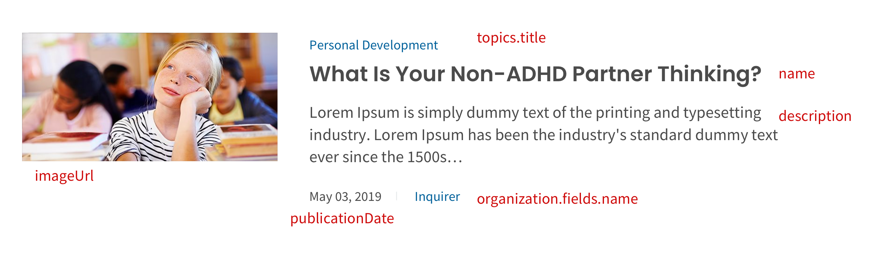

# CredibleMind Coding test

Our mission is to help everyone optimize their mental health, emotional wellbeing and spiritual growth. Here we are going to do simple version of news list page. Please read the following instruction carefully. Expected test could be finished in 3-5 hours. Welcome to raise any question.

## General Instructions

- Fork this repo
- Start `Coding!`
- Push your solution to your forked repo and we will check it

## Installation

```bash
yarn install
or
npm i
```

## How to run

### Client

```bash
yarn run dev
```

to launch web client http://localhost:3000


```developers@crediblemind.com
```

## Frontend test requirement

#### Implement news list page **_with_** search feature such as


a) Fetch news page config from contentful data and display

- use contentful service provided in `/lib/contentfulService.ts`
- content-type=`newsConfig`
- use response data to display image, title, menu label and filter/search label dynamically. Please refer below for field mapping of text in red
  

b) Fetch news data from algolia **_news_** index and display

- use algolia service to fetch all the data, config is provided in `/lib/algoliaService.ts`
- display news card as per the design (as close as possible)
- news card field mapping is found below as text in red color
  
- display all the news card (Bonus if you add infinite scroll)

c) Implement filter/search

- create search box as per design
- implement search feature using algolia search, hitting search icon should update the news list based on search results
- create a filter box following the design pattern
- implement filter by topic title using algolia search, selecting a topic title should filter the results to the ones containing the topic on the `topics.title` field

d) Create news item page

- clicking each card should redirect to news item page `/news/<slug>`
- item page should display the same card ui

e) Bonus

- implement login/signup with google using firebase with config provided in `/lib/firebaseConfig.ts` using `next-auth`
- make the page protected if non-authenticated with logout feature
- add display toggle between normal list and carousel
- deploy working solution live using netlify or vercel

## Worth mentioning

- Use `Material UI` for ui styling (overkill for this task but it's important to be familiar with it)
- Can specify future works if you don't have time for your implementation
- Good commit history with detailed commit message
